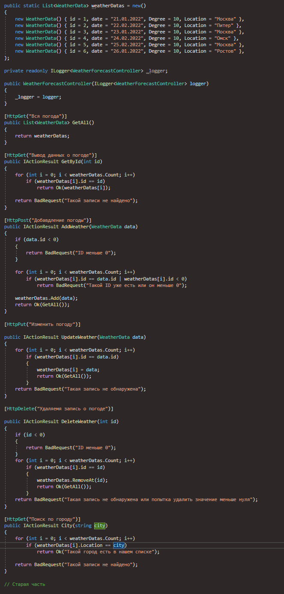

<h1 align="center">Привет, это <a href="https://github.com/TheFl1ppy" target="_blank">Максим</a> 
</h1>

<h1 align="center">Это первое задание: <a href="https://github.com/TheFl1ppy/API/tree/main/API1" target="_blank"> API </a>
  

  
 

  
 

<h1 align="center">Это второе задание: <a href="https://github.com/TheFl1ppy/API/tree/main/API1" target="_blank"> API </a>
  

  
 

  
 

